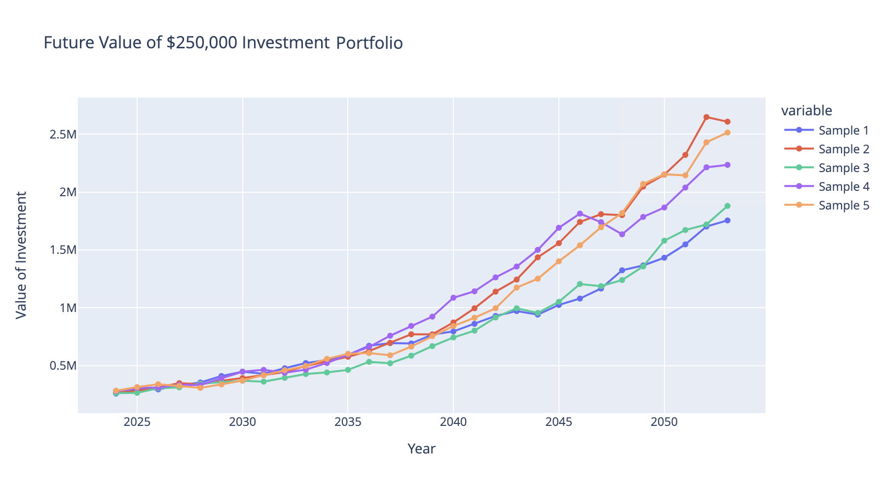

# Retirement_Forecasting
The goal of this data project is to create a retirement simulator to see the effects of portfolio investments that are fully invested in the stock market, aggressively invested, moderately invested or conservatively invested.

This idea came from a retirement simulator that I built in excel.

The included Jupyter notebook shows the coding utilized to create a database of future return rates for the stock market, including a series of managed portfolios (aggressive, moderate and conservative).

## Stock Market Data
The stock market returns came from the Sterns school of business, and included a range of historical market values, including T-Bills, Real Estate and Gold.  My analysis focused on market returns

[Stock Market Data Source](https://pages.stern.nyu.edu/~adamodar/New_Home_Page/datafile/histretSP.html)

## Plotting the return rate distributions

After researching historical portfolio performance, I worked with both the mean sample sizes and the return rate columns from the historical table to create return distributions that best matched expected portfolio performance.

While the S&P 500 returns have the greatest spread, this set of returns also has the highest return rate.
As you shift from aggressive down to moderate, the distribution tightens, but the average return rate also decreases. The conservative investment will be the most predictable, but have the lowest average return.

### Sources:
[Stock Market Performance](https://www.sciencedirect.com/science/article/pii/S2405473915000331)  
I analyzed historical stock trends and consulted with a local wealth management firm to compare this hypothetical future performance to industry expectations.

## A random walk through probability

The random walk theory claims that stock prices are not influenced by history, but rather a random walk that follows an upward slope. Additionally, the Black-Scholes/Merton equation explores the probability distribution of the markets in great depth, focusing on the correlation between brownian motion and the probability distrubtion found in finances.

I investigated the directions of change (derivatives) from 1928 to 2023, and found that the expected distribution resulted in 41 years with an increase in rate of return, and 52 years of decrease. Looking at the visual of my analysis, the stock market was positive for 70 of the 96 years surveyed, and negative for 26 of those years.

The goal of this retirement simulator is to simulate the same patterns found in the historical stock market to forecast the probable distribution of future returns.   

### Sources:
[Random Walk](https://www.sciencedirect.com/science/article/pii/S2405473915000331)  
[Black-Scholes/Merton Equation](https://www.youtube.com/watch?v=A5w-dEgIU1M)

*I can calculate the motion of heavenly bodies, but not the madness of people.” — Sir Isaac Newton.*

## Visualizing variability
This retirement simulator is meant to display the inherent variability of investing. Each entry into the retirement simulator will return 5 sample distributions, show an average rate of return for the most recent forecast, in addition to high and low ends of the distribution.

This is still a work in progress.  Stay tuned!

