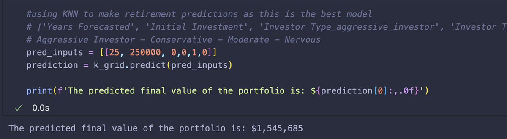

# Retirement Forecasting
The goal of this data project was to create a retirement simulator that would show the effects of portfolio investments that are fully, aggressively, moderately, or conservatively invested in the stock market. The mathematical methods and functions created in this notebook were converted to a Streamlit-based data application.

[Retirement Simulator Data Application](https://retirement-simulator.streamlit.app/)

## Stock Market Data
The stock market returns came from the Sterns School of Business and included a range of historical market values, including T-Bills, Real Estate, and Gold.  My analysis focused on market returns

[Stock Market Data Source](https://pages.stern.nyu.edu/~adamodar/New_Home_Page/datafile/histretSP.html)

## Plotting the return rate distributions

After researching historical portfolio performance, I used the mean sample sizes and return rate columns from the historical table to create return distributions that best matched expected portfolio performance.

While the S&P 500 returns have the greatest spread, this set of returns also has the highest return rate.
As you shift from aggressive down to moderate, the distribution tightens, but the average return rate also decreases. The conservative investment will be the most predictable but have the lowest average return.

**Return Rate Statistics**
After fine-tuning my forecasted investment returns, I ran a statistical analysis to validate my results across historical trends.  Note that more aggressive returns will have a wider confidence level created by the increased volatility. Aggressive investors will see a greater return over a long investment window, but this higher return does come with an added risk.

### Sources:
[Stock Market Performance](https://www.sciencedirect.com/science/article/pii/S2405473915000331)  
I analyzed historical stock trends and consulted with a local wealth management firm to compare this hypothetical future performance to industry expectations.

## A random walk through probability

The random walk theory claims that stock prices are not influenced by history but rather by a random walk that follows an upward slope. Additionally, the Black-Scholes/Merton equation explores the probability distribution of the markets in great depth, focusing on the correlation between Brownian motion and the probability distribution found in finances.

I investigated the directions of change (derivatives) from 1928 to 2023 and found that the expected distribution resulted in 41 years of an increase in rate of return and 52 years of a decrease. Looking at my analysis's visual, the stock market was positive for 70 of the 96 years surveyed and negative for 26 of those years.

The goal of this retirement simulator is to simulate the same patterns found in the historical stock market to forecast the probable distribution of future returns.   

### Sources:
[Random Walk](https://www.sciencedirect.com/science/article/pii/S2405473915000331)  
[Black-Scholes/Merton Equation](https://www.youtube.com/watch?v=A5w-dEgIU1M)

*I can calculate the motion of heavenly bodies, but not the madness of people.” — Sir Isaac Newton.*

## Visualizing variability
After validating my retirement value distributions, I created a retirement simulator function meant to display the inherent variability of investing. The user is asked to enter an initial investment, their investor type (aggressive, moderate, conservative, or nervous), and the number of years to forecast. Each entry into the retirement simulator displays 5 retirement forecast scenarios, a geometric rate of return, and the high and low ends of the results. This simulator effectively works as a roll of the dice, each entry will return varying results.

## Learning from the Past
The retirement simulator function was utilized to generate 10,000 hypothetical investment scenarios. Initial investment values were randomly generated, ranging from $100,000 to $2,000,000, with a range of investment years from 10-50. The hypothetical dataset was saved as a CSV and then utilized for machine learning.

*Modeling:* Linear regression, ridge regression, and KNN were the machine learning models tested. A grid search was set up to optimize the parameters for each model.
*Cross-validation:* After assessing the model performance, the KNN model proved to be the best predictor of retirement values. The KNN model was implemented to create predictions.

### Predicting the Future
In this retirement forecasting method, machine learning analyzes a large volume of hypothetical returns to predict a future retirement value based on user inputs. Rather than a series of samples, the user sees a final, most probable forecast.

Below is a visual showing the data used in the machine-learning model.  Note that the more aggressive the investor, the wider the range of variability (shaded bands).  Additionally, despite the nervous investors pulling from the same return table as the aggressive investors, they see the worst portfolio performance. The model teaches the nervous investor to pull out of the market for 3 years every time the market has negative returns, resulting in poor returns.

